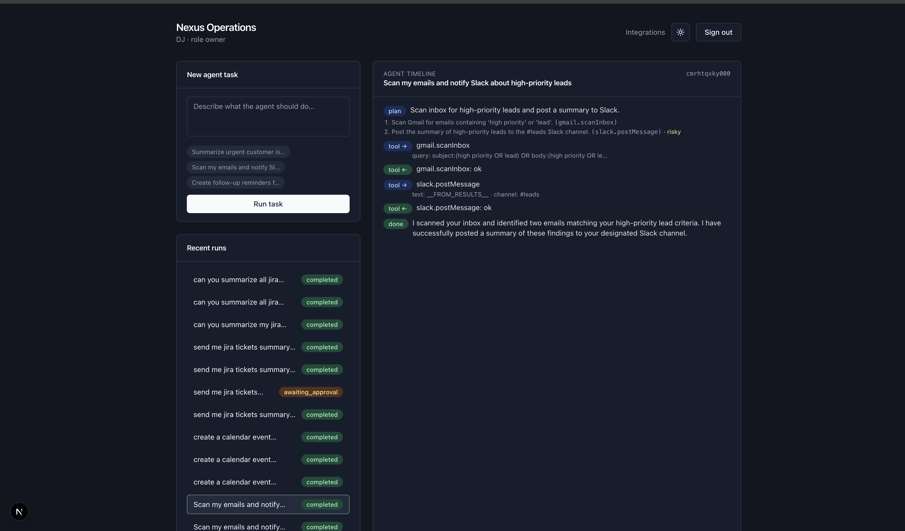
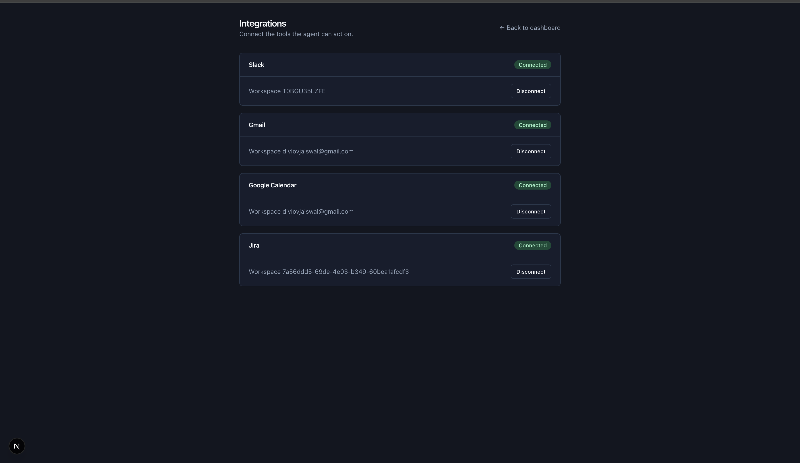
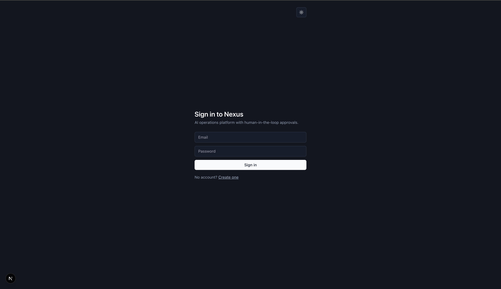

# Nexus — AI Operations Platform

Nexus is an **async, multi-tenant, queue-driven agent orchestration platform**. Users connect integrations (Gmail, Slack, Jira, Calendar) and issue natural-language commands; an agent **plans** the work, **calls tools**, **pauses on risky actions for human approval**, **resumes**, **audits everything**, and **streams progress in real time**.

It is deliberately *not* a CRUD app or a ChatGPT wrapper. The design goal is to demonstrate production patterns: clean service boundaries, secure credential handling, background processing, human-in-the-loop control, and real-time UX.

> **Demo mode is on by default** (`NEXT_PUBLIC_IS_DEMO_MODE=true`) — the agent runs entirely on mocked plans/tool-results with **zero external API calls and zero mutations**, so the public deployment is safe and free to operate.

---

## Architecture

```
                          ┌──────────────────────────── apps/web (Next.js 15) ───────────────────────────┐
  Browser ── SSE ───────▶ │  Route handlers (thin):  auth · POST /tasks (202) · POST /approvals · /stream │
        ▲                 │  Custom auth (JWT cookie, Argon2id)   ·   BullMQ producer only                │
        │                 └───────────────┬───────────────────────────────────┬──────────────────────────┘
        │ progress events                 │ enqueue                            │ subscribe
        │ (Redis pub/sub)        ┌─────────▼─────────┐                ┌─────────▼─────────┐
        └────────────────────────│   Redis / BullMQ  │                │   PostgreSQL      │
                                 │  agent-tasks queue │                │  + pgvector       │
                                 └─────────┬─────────┘                └─────────▲─────────┘
                                           │ consume                            │ persist state + audit
                          ┌────────────────▼─────────────── apps/worker (Node) ─┴──────────────────────────┐
                          │  LangGraph loop: plan → execute ⇄ loop → complete                              │
                          │  Risky step → create Approval, checkpoint to DB, AWAITING_APPROVAL, pause      │
                          │  Approval decision → resume-task → continue from checkpoint                    │
                          └───────────────────────────────────────────────────────────────────────────────┘
```

### Monorepo layout

| Path | Responsibility |
|---|---|
| `apps/web` | Next.js App Router — UI + **thin** API gateway. Validates, authenticates, enqueues. Never runs AI. |
| `apps/worker` | Node service. **All** AI execution: LangGraph loop, tool calls, approval pause/resume, audit, progress publishing. |
| `packages/shared` | Zod env config, AES-256-GCM crypto, domain types / DTOs, queue constants + Redis connection. |
| `packages/db` | Prisma schema (multi-tenant), client singleton, pgvector migration. |
| `packages/ai` | LangGraph orchestration, tool registry, Gemini runtime, demo runtime, `createAgentRuntime` factory. |
| `packages/ui` | Minimal shared React components. |

---

## Key engineering decisions

- **Queue-first.** API routes validate → create a job row → enqueue → return **202**. No long-running work on the request path. All AI execution lives in the worker.
- **Human-in-the-loop via DB checkpoint.** When the agent hits a *risky* tool, the worker serializes the full graph state into `AgentJob.checkpoint`, records an `Approval`, sets `AWAITING_APPROVAL`, and ends the job cleanly. The approval API enqueues a `resume-task`; the worker rehydrates the checkpoint and continues. Using the DB as the durable store (rather than an in-process checkpointer) is what makes pause/resume survive across separate worker invocations.
- **One demo switch.** `createAgentRuntime(isDemo)` returns either the Gemini runtime or the demo runtime behind a single `AgentRuntime` interface — the worker and graph never branch on demo mode again.
- **Secrets never in plaintext.** OAuth tokens are stored only as AES-256-GCM ciphertext (`packages/shared/crypto.ts`); the audit logger scrubs secret-looking fields.
- **Multi-tenancy everywhere.** Every tenant-scoped row carries `orgId`; every query is org-filtered. Cross-tenant access is treated as a security bug.
- **Fail-fast config.** All env vars are Zod-validated in one module; `process.env` is never read elsewhere.
- **Real-time over polling.** Worker publishes `ProgressEvent`s to a per-job Redis channel; the web app relays them to the browser over SSE.

---

## Tradeoffs

Deliberate choices made in favor of one property at the cost of another:

- **JWT + Argon2id instead of Clerk/Auth0.** No vendor lock-in and full control over the session/tenant model, at the cost of hand-rolling password hashing, session cookies, and (currently) no social login or MFA — those would need to be built, not toggled on.
- **DB-backed checkpoint instead of an in-memory/Redis checkpointer.** Pause/resume survives worker restarts and horizontal scaling because state lives in Postgres (`AgentJob.checkpoint`), not in worker memory. The cost: every pause/resume is a DB round-trip, and the full LangGraph state must stay JSON-serializable — no closures or class instances in graph state.
- **BullMQ instead of a managed workflow engine (Temporal, Inngest).** Cheaper to self-host and simpler mental model for this scope, but there's no built-in run visualizer or replay debugger — the audit log and agent timeline exist specifically to fill that gap by hand.
- **A hard-coded tool registry instead of dynamic tool discovery.** The LLM can only call the six tools in `packages/ai/src/tools/registry.ts` — it can't invent actions, which is a real security property. The cost is that adding a new integration is a code change + redeploy, not just an OAuth connect.
- **One demo-mode switch instead of a parallel mocked codebase.** `createAgentRuntime(isDemo)` keeps the exact same graph and tool-call shape in both modes, so the demo can't silently drift from production behavior. The cost is discipline: every new tool needs a plausible mocked result added by hand, or the demo goes stale.
- **Single long-lived worker process instead of per-job invocation (e.g. Lambda).** Cheaper for a queue that's rarely idle and avoids cold starts on LangGraph loops, but it doesn't scale to zero and concurrency is capacity-planned via BullMQ's concurrency setting rather than autoscaled per-job.

---

## Scaling discussion

- **Web** is stateless Next.js — scales horizontally behind Vercel with no coordination needed.
- **Worker** scales horizontally by running more replicas; BullMQ's per-job locking is the coordination point, so adding workers is safe without additional application logic. Throughput is bounded by each worker's concurrency setting and by Gemini API rate limits, not by the queue itself.
- **Postgres** is the current bottleneck under tenant growth: every query is `orgId`-filtered (see [Multi-Tenancy](#key-engineering-decisions)), so composite indexes on `(orgId, ...)` matter well before row count does. At worker-fleet scale, put Prisma behind a pooler (e.g. PgBouncer) — each worker replica otherwise holds its own connection pool.
- **Redis** currently serves double duty: BullMQ queue storage and progress pub/sub for SSE. That's fine at today's scale; splitting them into separate instances is the first move if either queue depth or SSE fanout becomes noisy.
- **SSE fanout** is the one place scaling isn't free: a browser's SSE connection is pinned to whichever web instance accepted it, so progress events must reach that specific instance. Redis pub/sub already solves this (every web instance subscribes and relays), but it does mean SSE, unlike the rest of the web tier, isn't purely stateless.
- **Rate limiting** does not exist yet (tracked in the roadmap below) — this is the main gap between "demo-safe" and "production-safe" multi-tenant usage.

---

## Getting started

### Prerequisites
- Node ≥ 20, **pnpm** (`npm i -g pnpm`)
- Docker (for local Postgres + Redis)

### Setup

```bash
pnpm install

# Local infra (Postgres w/ pgvector + Redis)
docker compose up -d

# Environment
cp .env.example .env
# generate keys:
#   openssl rand -base64 32   → ENCRYPTION_KEY
#   openssl rand -base64 48   → AUTH_SECRET

# Database
pnpm --filter @nexus/db db:generate
pnpm --filter @nexus/db db:migrate
pnpm --filter @nexus/db db:pgvector   # adds the vector column + index

# Run (two terminals)
pnpm --filter @nexus/web dev          # http://localhost:3000
pnpm --filter @nexus/worker dev
```

In **demo mode** (default) you can open `http://localhost:3000/dashboard` directly — no login, no Gemini key. Submit a task like *"Summarize urgent customer issues and create Jira tickets"* and watch the timeline stream, pause on the risky Jira step for approval, then resume.

To run against real Gemini and real integrations: set `NEXT_PUBLIC_IS_DEMO_MODE=false` and `GEMINI_API_KEY=…` (free key from https://aistudio.google.com/apikey), then connect each provider from **Integrations** in the top nav. Gmail, Slack, Google Calendar, and Jira all have live OAuth connect flows and real tool execution — see [Supported tools](#supported-tools).

---

## Demo walkthrough

*(Loom link goes here — record a 2–3 min walkthrough: submit a task, watch the plan/tool-call timeline stream, hit the approval pause, approve, resume to completion.)*

## Screenshots

| Dashboard — submit a task, browse recent runs | Integrations — connect Gmail, Slack, Calendar, Jira |
|---|---|
|  |  |

| Sign in |
|---|
|  |


---

## Supported tools

The agent's capabilities are exactly the tools registered in `packages/ai/src/tools/registry.ts` — nothing else is reachable, which keeps the LLM's action space explicit and auditable.

| Tool | Provider | Risky? | Notes |
|---|---|---|---|
| `gmail.scanInbox` | Gmail | read-only | Search + summarize recent messages |
| `slack.readChannel` | Slack | read-only | Read recent messages from a channel |
| `slack.postMessage` | Slack | **risky** | Requires approval before posting |
| `jira.searchIssues` | Jira | read-only | JQL search across accessible projects |
| `jira.createIssue` | Jira | **risky** | Requires approval before creating |
| `calendar.createEvent` | Google Calendar | **risky** | Requires approval before creating |

Risky tools pause the run and create an `Approval` row (see [Key engineering decisions](#key-engineering-decisions)); read-only tools execute immediately. In demo mode, every tool call is short-circuited to a mocked result — no live connector is invoked.

---

## Deployment targets
- **Web** → Vercel
- **Worker** → Render / Fly.io (long-lived Node process)
- **Redis** → Upstash · **Postgres** → Neon (enable the `vector` extension)

---

## Roadmap (out of current scope)
Polished dashboard/design system · full RAG over pgvector · rate limiting · billing · automated test suite · CI/CD.
